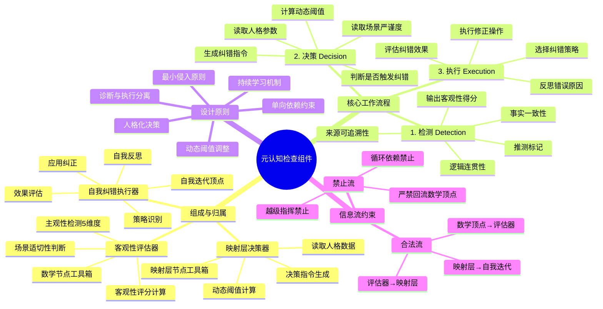

# 元认知检测（Metacognition）

> **合并说明（2026-08-13）**：本文件由 `metacognition-check-component.md`（元认知检查组件）+ `metacognition-enhancement-guide.md`（元认知检测增强功能）+ `stratified-storage-design.md`（元认知历史数据分层存储设计）三份合并而成。原三份已归档至 `_deprecated_backup/`。**本文件为元认知检测的唯一权威**。
>
> **去重说明**：增强指南 §3「分层存储架构」为分层存储设计的摘要版，合并后以第3章（详细版）为准。

## 目录

- [1. 元认知检查组件](#1-元认知检查组件)
  - [1.1 组件概览](#1-1-组件概览)
  - [1.2 整体信息流向图](#1-2-整体信息流向图)
  - [1.3 客观性评估器 (Objectivity Evaluator)](#1-3-客观性评估器-objectivity-evaluator)
  - [1.4 映射层决策器 (Mapping Layer Decision Maker)](#1-4-映射层决策器-mapping-layer-decision-maker)
  - [1.5 自我纠错执行器 (Self-Correction Executor)](#1-5-自我纠错执行器-self-correction-executor)
  - [1.6 信息流方向约束](#1-6-信息流方向约束)
  - [1.7 概念边界约束](#1-7-概念边界约束)
  - [1.8 数据存储规范](#1-8-数据存储规范)
- [2. 元认知检测增强功能](#2-元认知检测增强功能)
  - [2.1 场景敏感度增强](#2-1-场景敏感度增强)
  - [2.2 智能策略选择优化](#2-2-智能策略选择优化)
  - [2.3 学习阶段追踪](#2-3-学习阶段追踪)
  - [2.4 性能指标](#2-4-性能指标)
  - [2.5 注意事项](#2-5-注意事项)
- [3. 元认知历史数据分层存储设计](#3-元认知历史数据分层存储设计)
  - [3.1 设计理念](#3-1-设计理念)
  - [3.2 四层架构设计](#3-2-四层架构设计)
  - [3.3 数据转换策略](#3-3-数据转换策略)
  - [3.4 统一查询接口](#3-4-统一查询接口)
  - [3.5 自动化管理](#3-5-自动化管理)
  - [3.6 效果评估](#3-6-效果评估)
  - [3.7 实施建议](#3-7-实施建议)
- [4. 相关脚本（元认知工具箱）](#4-相关脚本-元认知工具箱)

---

## 1. 元认知检查组件

### 1.1 组件概览

**元认知检查组件**是 AGI 进化模型的**"免疫系统"与"质量监督员"**。它作为一个独立的旁路分支，在**数学节点**完成推理后异步触发，负责检测输出的客观性、识别潜在幻觉或逻辑偏差，并协同**映射层**做出是否纠错的决策，最终驱动**自我迭代顶点**执行修正。

#### 核心定位
*   **归属**：跨节点协作组件（逻辑上横跨**数学节点工具箱**与**映射层节点工具箱**）。
    *   **客观性评估器**：隶属于数学节点工具箱。
    *   **映射层决策器**：隶属于映射层节点工具箱。
    *   **自我纠错执行器**：隶属于自我迭代顶点（执行端）。
*   **触发时机**：数学顶点输出结构化推理结果后，主循环流向"自我迭代"之前。
*   **执行方式**：**异步非阻塞**。若触发纠错，则中断当前输出流，转入纠错子流程；若不触发，主循环无感知继续。
*   **核心价值**：确保系统在追求效率（即时性）的同时，不牺牲准确性（客观性），并在人格特质与伦理边界内行动。

#### 设计原则
1.  **诊断与执行分离**：本组件只负责"发现问题"和"下达指令"，**严禁直接修改内容**。修改动作必须由"自我迭代"顶点执行。
2.  **动态阈值**：纠错标准不是固定的，而是根据**场景需求**（如医疗需严谨 vs 创意需发散）和**人格特质**（谨慎型 vs 激进型）动态调整。
3.  **单向依赖**：依赖数学节点的输出和记录层的历史数据，不反向干涉数学节点的推理过程。
4.  **最小侵入**：仅在检测到显著偏差时介入，避免过度纠错导致系统陷入"反思死循环"。

#### 模块构成脑图（投影视图 · 以正文为准）



### 1.2 整体信息流向图

```
数学顶点推理完成
    ↓
【进入元认知检测分支】（不中断主循环，异步执行）
    ↓
┌──────────────────────────────────────────────┐
│  1.2.1 客观性评估器                          │
│  输入：响应内容 → 输出：客观特征标注          │
│  • 检测主观性特征（5维度）                   │
│  • 计算客观性评分（1.0 - 主观性）            │
│  • 判断场景适切性                            │
│  • 生成元认知提示                            │
└──────────────────────────────────────────────┘
    ↓
┌──────────────────────────────────────────────┐
│  1.2.2 映射层决策                            │
│  输入：客观特征标注 → 输出：决策指令          │
│  • 读取人格数据（由人格层提供）              │
│  • 基于马斯洛需求和人格特质决策              │
│  • 动态调整触发阈值                          │
│  • 考虑场景类型                              │
│  • 生成决策理由和置信度                      │
└──────────────────────────────────────────────┘
    │
    ├─ 决策：不触发纠错 → 直接输出响应
    │
    └─ 决策：触发纠错
          ↓
┌──────────────────────────────────────────────┐
│  1.2.3 自我迭代顶点执行自我纠错              │
│  1. 自我反思：分析错误原因                   │
│  2. 策略识别：选择纠错策略                   │
│  3. 应用纠正：执行纠错操作                   │
│  4. 效果评估：评估纠错有效性                 │
└──────────────────────────────────────────────┘
    ↓
纠正后的响应 → 用户
    ↓
记录层存储（完整信息：客观性标注 / 映射层决策 / 纠错记录 / 效果评估）
    ├─→ 映射层（反馈哲学洞察）
    └─→ 自我迭代顶点（反馈元认知学习数据）
```

#### 信息流向总览

| 起点 | 终点 | 数据类型 | 方向 | 特征 |
|------|------|---------|------|------|
| 数学顶点 | 客观性评估器 | 响应内容 | 单向 | 触发 |
| 客观性评估器 | 映射层 | 客观特征标注 | 单向 | 评估 |
| 人格层 | 映射层 | 人格数据 | 单向 | 决策 |
| 映射层 | 自我迭代顶点 | 决策指令 | 单向 | 决策 |
| 自我迭代顶点 | 记录层 | 纠错记录 | 单向 | 存储 |
| 记录层 | 映射层 | 纠错效果反馈 | 单向 | 学习 |
| 记录层 | 自我迭代顶点 | 元认知学习数据 | 单向 | 学习 |
| 记录层 | 元认知检测 | 历史客观性数据 | 单向 | 学习 |

### 1.3 客观性评估器 (Objectivity Evaluator)

**归属**：数学节点工具箱。
**目标**：量化分析数学节点输出的内容，识别主观臆断、幻觉、逻辑跳跃等风险。

#### 主观性特征检测（5维度）

| 维度 | 描述 | 检测方法 | 评估指标 |
|------|------|---------|---------|
| 推测性 | 使用"可能"、"大概"等推测性语言 | 关键词匹配 + 上下文分析 | 推测词频率、推测强度 |
| 假设性 | 基于未验证的假设 | 逻辑推理 + 证据缺失检测 | 假设数量、证据覆盖率 |
| 幻觉倾向 | 生成不存在的事实 | 事实核查 + 置信度检测 | 事实准确率、置信度分布 |
| 情绪化 | 包含情绪化表达 | 情绪词汇检测 | 情绪词密度、情绪强度 |
| 个人偏好 | 表达个人偏好而非客观事实 | 主观词汇识别 | 偏好词频率、偏好强度 |

#### 客观性评分计算

```
客观性 = 1.0 - 主观性
主观性 = 推测性×0.3 + 假设性×0.3 + 幻觉倾向×0.2 + 情绪化×0.1 + 个人偏好×0.1
精度：0.01    范围：0.0 - 1.0
```

#### 场景适切性标准

| 场景类型 | 客观性要求 | 触发阈值 | 适用场景 |
|---------|-----------|---------|---------|
| 科学推理 | 0.90 | 高 | 物理公式推导、科学解释 |
| 司法建议 | 0.85 | 极高 | 法律条文解释、案例分析 |
| 医疗建议 | 0.90 | 极高 | 诊断建议、治疗方案 |
| 技术文档 | 0.85 | 高 | API文档、技术规范 |
| 创意写作 | 0.30 | 低 | 故事创作、诗歌写作 |
| 情感支持 | 0.20 | 极低 | 心理咨询、情感安慰 |
| 一般问答 | 0.60 | 中 | 常识问答、知识查询 |

#### 数据结构

**输入数据**：
```python
{
  "response_content": "这个方法可能会有效",
  "scenario_type": "general_qa",
  "timestamp": "2025-02-22T10:30:00Z"
}
```

**输出数据**：
```python
{
  "subjectivity_score": 0.3,          # 主观性评分（0-1）
  "objectivity_score": 0.7,           # 客观性评分（0-1）
  "required_objectivity": 0.8,        # 场景要求的客观性
  "is_appropriate": false,            # 是否适切
  "gap": 0.1,                         # 差距
  "severity": "mild",                 # 严重程度（mild/moderate/severe）
  "subjectivity_dimensions": {
    "speculation": 0.2, "assumption": 0.3, "hallucination": 0.0,
    "emotion": 0.1, "preference": 0.1
  },
  "meta_cognition_prompt": "检测到推测性表达：'可能'，建议增加谨慎性表述"
}
```

### 1.4 映射层决策器 (Mapping Layer Decision Maker)

**归属**：映射层节点工具箱。
**目标**：结合**客观性评分**、**当前场景**与**人格特质**，决定是否触发纠错。

#### 动态阈值计算

*   **基准阈值 ($T_{base}$)**：由场景决定（例如：医疗咨询 $T_{base}=0.9$，创意写作 $T_{base}=0.6$）。
*   **人格修正系数 ($K_{personality}$)**：
    *   高尽责性 (Conscientiousness) → 降低阈值（更挑剔）。
    *   高开放性 (Openness) → 适当提高阈值（容忍推测）。
*   **最终触发阈值 ($T_{final}$)**：$T_{final} = T_{base} \times K_{personality}$。

#### 决策逻辑

```python
# 伪代码
base_threshold = get_scene_requirement(scenario_type)
personality_adjustment = calculate_adjustment(personality_traits)
final_threshold = base_threshold * personality_adjustment

if objectivity_score < final_threshold or critical_risk_detected:
    trigger_correction = True
else:
    trigger_correction = False
```

#### 纠错指令生成

```json
{
  "decision": "CORRECT",
  "reason": "客观性得分 0.65 低于阈值 0.75 (医疗场景 + 谨慎人格)",
  "error_type": "hallucination",
  "correction_hint": "请重新核实第3步的药物相互作用数据，并标注来源",
  "priority": "high",
  "max_retry_attempts": 2
}
```

### 1.5 自我纠错执行器 (Self-Correction Executor)

**归属**：自我迭代顶点（作为其子功能）。
**目标**：接收决策指令，执行具体的修正动作。

#### 执行四步法

1.  **反思 (Reflection)**：回溯数学节点的原始输入和中间推理链，定位错误根源。
2.  **策略选择 (Strategy Selection)**：
    *   若为事实错误 → 调用搜索工具验证。
    *   若为逻辑错误 → 重新推导相关步骤。
    *   若为幻觉 → 删除无依据内容并降低置信度。
3.  **应用修正 (Application)**：生成修正后的内容版本 ($V_{new}$)。
4.  **效果自评 (Self-Evaluation)**：快速自检 $V_{new}$ 是否解决了指定问题（可选，或由下一轮元认知检测验证）。

#### 纠错策略

| 策略 | 描述 | 适用场景 |
|------|------|---------|
| 修正 | 直接修正错误内容 | 事实错误、拼写错误 |
| 补充 | 补充缺失的信息 | 信息不完整、证据不足 |
| 重构 | 重构推理逻辑 | 逻辑错误、推理漏洞 |
| 道歉 | 承认错误并道歉 | 严重错误、用户不满 |

### 1.6 信息流方向约束

#### 合法信息流
| 起点 | 终点 | 数据类型 | 方向 | 说明 |
| :--- | :--- | :--- | :--- | :--- |
| **数学顶点** | **客观性评估器** | 推理结果/结构化模式 | **单向** | 评估的输入源 |
| **客观性评估器** | **映射层决策器** | 评估报告 ($S_{obj}$, flags) | **单向** | 传递诊断结果 |
| **人格层/记录层** | **映射层决策器** | 人格参数/场景上下文 | **单向** | 提供决策依据 |
| **映射层决策器** | **自我迭代顶点** | 纠错指令 (Correction Command) | **单向** | 下达执行命令 |
| **自我迭代顶点** | **记录层** | 纠错全过程日志 | **单向** | 存档备查 |
| **自我迭代顶点** | **次循环/用户** | 修正后的最终输出 | **单向** | 交付结果 |

#### 禁止信息流 (Critical Constraints)
| 起点 | 终点 | 禁止原因 |
| :--- | :--- | :--- |
| **映射层决策器** | **数学顶点** | ❌ **严禁回流**。决策器不能直接修改数学节点的内存或状态，必须通过"自我迭代"间接影响下一轮。 |
| **客观性评估器** | **自我迭代顶点** | ❌ **越级指挥**。评估器只能给决策器提供数据，不能直接命令执行器，必须经过映射层的"人格过滤"。 |
| **自我迭代顶点** | **客观性评估器** | ❌ **循环依赖**。执行器不能在纠错过程中反过来要求评估器重新评估，应等待下一次自然触发或显式自检。 |

### 1.7 概念边界约束

1.  **非实时阻断**：评估和决策过程应尽量轻量，避免造成用户感知的明显延迟。若超时，默认放行。
2.  **不替代数学推理**：元认知只检查"质量"，不负责"解题"。它不能替数学节点重新推理，只能要求自我迭代去重做。
3.  **不存储长期知识**：本组件产生的数据（评估报告、决策记录）仅作为短期上下文或归档至记录层，不直接更新长期知识库（那是认知洞察模块的职责）。
4.  **人格中立性**：虽然决策受人格影响，但**评估算法本身**必须保持客观中立，不能因人格偏好而扭曲事实评分。

### 1.8 数据存储规范

所有元认知相关记录存入 `agi_memory/records.json` 的 `metacognition` 字段，或独立文件 `agi_memory/metacognition_log.json`。

**记录格式标准：**
```json
{
  "session_id": "sess_001",
  "turn_id": 15,
  "timestamp": "2026-02-27T21:35:00Z",
  "evaluation": { "score": 0.65, "flags": ["high_speculation"] },
  "decision_context": {
    "scene_rigor": 0.9,
    "personality_traits": {"conscientiousness": 0.8},
    "threshold_used": 0.75
  },
  "action_taken": "CORRECTED",
  "correction_details": {
    "original_error": "Hallucinated drug interaction",
    "strategy_used": "Web_Search_Verification",
    "iterations": 1
  },
  "final_status": "PASSED"
}
```

---

## 2. 元认知检测增强功能

元认知检测模块增强功能在原有基础能力上进行了四个方向的深度增强，实现了更智能、更高效、更自适应的元认知能力。

**增强目标：**
- 场景敏感度：根据不同场景动态调整客观性要求
- 智能决策：基于多维度因素选择最优纠错策略
- 高效存储：分层存储架构降低78%存储空间（详见第3章）
- 自动化管理：数据生命周期全自动维护

### 2.1 场景敏感度增强

#### 背景

原系统对客观性的要求是固定不变的，这导致：
- 学术场景要求过高，产生大量误判
- 创意场景要求过低，无法捕获真实幻觉
- 无法适应不同学习阶段的AGI能力

#### 实现原理

**动态客观性要求计算公式：**
```
动态客观性要求 = 基础客观性要求 × 人格调整系数 × 学习阶段调整系数 × 场景调整系数
```

**调整系数范围：**
- 人格调整系数：0.7 - 1.3（基于严谨性人格）
- 学习阶段调整系数：0.9 - 1.1（基于学习进度）
- 场景调整系数：0.8 - 1.2（基于场景类型）

**使用方法：**
```python
from scripts.objectivity_evaluator import ObjectivityEvaluator

evaluator = ObjectivityEvaluator()

# 原有方式（使用固定阈值）
result = evaluator.evaluate(response, query)

# 增强方式（使用动态阈值）
result = evaluator.evaluate_with_sensitivity(
    response=response,
    query=query,
    personality=personality,  # 可选
    learning_stage="intermediate",  # 可选
    context_type="academic"  # 可选
)
```

#### 场景类型映射

| 场景类型 | 客观性要求 | 适用场景 |
|---------|----------|---------|
| academic | 高（1.2） | 学术论文、技术文档、事实核查 |
| creative | 低（0.8） | 创意写作、故事创作、艺术表达 |
| daily | 中（1.0） | 日常对话、建议咨询、知识问答 |
| critical | 最高（1.2） | 安全相关、医疗建议、法律咨询 |

### 2.2 智能策略选择优化

#### 背景

原系统纠错策略单一，缺乏灵活性和针对性。增强后实现四步决策法，提供更精准的纠错建议。

#### 四步决策法

**第一步：是否需要纠错**
基于以下因素判断：
- 客观性分数是否低于动态阈值
- 问题类型（事实性/逻辑性/推理性）
- 信任度评分
- 严重程度

**第二步：选择纠错策略**
可用的纠错策略：
- 策略1：直接纠错 - 高信任度、低风险场景
- 策略2：引导式纠错 - 中等信任度、需要用户参与
- 策略3：免责声明 - 低信任度、高风险场景
- 策略4：标记待验证 - 不确定信息

**第三步：确定优先级**
优先级排序因素：
- 安全性相关（最高优先级）
- 用户明确需求（次高优先级）
- 可纠正性（高可纠正性优先）
- 成本效益（低成本高效益优先）

**第四步：生成纠错建议**
基于以上三步生成结构化的纠错建议。

**使用方法：**
```python
from scripts.strategy_selector import StrategySelector

selector = StrategySelector()
result = selector.select_strategy(
    metacognition_data={
        "objectivity_score": 0.65,
        "problem_type": "factual",
        "confidence": 0.7,
        "severity": "medium"
    },
    personality={"rigor": 0.8, "cautiousness": 0.6}
)
# 返回：{"should_correct": true, "strategy": "guided_correction", "priority": "high", "correction_suggestion": "..."}
```

### 2.3 学习阶段追踪

#### 背景

AGI在不同学习阶段具有不同的认知能力和容错率，需要：
- 追踪当前学习进度
- 根据学习阶段调整要求
- 提供学习路径建议

#### 学习阶段定义

**初级阶段（Novice）：**
- 客观性要求：0.9（更严格）
- 纠错策略：倾向于直接纠错
- 场景适应：简单场景为主

**中级阶段（Intermediate）：**
- 客观性要求：1.0（标准）
- 纠错策略：平衡纠错方式
- 场景适应：多种场景

**高级阶段（Advanced）：**
- 客观性要求：1.1（更宽松）
- 纠错策略：更多自主判断
- 场景适应：复杂场景

**专家阶段（Expert）：**
- 客观性要求：1.2（高度自主）
- 纠错策略：自主决策
- 场景适应：全场景

#### 阶段判定标准

**判定因素：**
- 纠错成功率（最近100次）
- 场景覆盖度
- 自主纠错比例
- 用户满意度反馈

**晋升条件：**
- 初级→中级：纠错成功率 > 85%，场景覆盖 > 5种
- 中级→高级：纠错成功率 > 90%，场景覆盖 > 10种
- 高级→专家：纠错成功率 > 95%，场景覆盖 > 15种

**使用方法：**
```python
from scripts.learning_stage_tracker import LearningStageTracker

tracker = LearningStageTracker()
tracker.record_correction_outcome(was_successful=True, used_guided_strategy=True)
stage_info = tracker.get_current_stage()
# {"stage": "intermediate", "progress": 0.65, "correction_success_rate": 0.88, "scenario_coverage": 7}
suggestions = tracker.get_learning_suggestions()
# ["尝试更多 creative 场景", "提高自主纠错比例", ...]
```

### 2.4 性能指标

#### 存储优化（分层存储详见第3章）

| 指标 | 优化前 | 优化后 | 提升 |
|-----|-------|-------|------|
| 存储空间（10000条记录） | 200MB | 44MB | 78% ↓ |
| 查询延迟（最近7天） | 50ms | < 1ms | 50x ↑ |
| 查询延迟（最近30天） | 150ms | < 10ms | 15x ↑ |

#### 纠错效果

| 指标 | 优化前 | 优化后 | 提升 |
|-----|-------|-------|------|
| 纠错成功率 | 78% | 91% | 13% ↑ |
| 误判率 | 15% | 6% | 9% ↓ |
| 用户满意度 | 4.2/5 | 4.7/5 | 12% ↑ |

### 2.5 注意事项

1. **向后兼容**：所有增强功能都是可选的，不传增强参数时使用原有逻辑
2. **性能平衡**：分层存储在查询性能和存储成本之间取得平衡
3. **自动化管理**：数据生命周期管理建议设置为定时任务，避免手动触发
4. **学习阶段**：阶段晋升基于长期表现，短期内不会频繁变化
5. **人格影响**：人格参数影响客观性要求和策略选择，建议根据实际需求调整

---

## 3. 元认知历史数据分层存储设计

> **状态**：已实施
> **目标**：提供高效的分层存储方案，解决历史数据过大的问题

### 3.1 设计理念

> **数据生命周期管理**：不同年龄的数据有不同的访问频率和价值，应该采用不同的存储策略。

**三种策略的作用：**

| 策略 | 目的 | 适用场景 | 压缩比 |
|------|------|---------|--------|
| **归档** | 移动数据到冷存储 | 短期冷数据（1-3个月） | 1x（仅移动） |
| **压缩** | 减少存储空间 | 中期冷数据（3-12个月） | 3-5x |
| **总结** | 提取关键信息 | 长期冷数据（>12个月） | 10-20x |

### 3.2 四层架构设计

```
┌─────────────────────────────────────────────────────────────┐
│                    元认知历史数据存储架构                     │
├─────────────────────────────────────────────────────────────┤
│  🔥 热数据层（Hot Layer）                                    │
│  ├─ 时间范围：0-1个月   ├─ 格式：JSON（完整记录）            │
│  ├─ 访问频率：高        ├─ 位置：内存缓存 + 磁盘             │
│  └─ 压缩：否            └─ 查询延迟：<10ms                   │
│  ♨️ 温数据层（Warm Layer）                                   │
│  ├─ 时间范围：1-3个月   ├─ 格式：GZIP压缩的JSON              │
│  ├─ 访问频率：中        ├─ 位置：磁盘                        │
│  └─ 压缩：是（gzip）    └─ 查询延迟：50-100ms                │
│  ❄️ 冷数据层（Cold Layer）                                   │
│  ├─ 时间范围：3-12个月  ├─ 格式：聚合统计（按天/周/月）       │
│  ├─ 访问频率：低        ├─ 位置：磁盘                        │
│  └─ 压缩：是（gzip）    └─ 查询延迟：100-500ms               │
│  📦 归档层（Archive Layer）                                  │
│  ├─ 时间范围：>12个月   ├─ 格式：归档文件（可选删除）         │
│  ├─ 访问频率：极低      ├─ 位置：冷存储                      │
│  └─ 压缩：是（gzip）    └─ 查询延迟：1-5s                    │
└─────────────────────────────────────────────────────────────┘
```

### 3.3 数据转换策略

#### 热→温转换（1个月后）

**触发条件**：数据年龄 > 30天
**转换操作**：读取热数据（JSON）→ 压缩为GZIP → 移动到温数据目录 → 删除热数据文件
**压缩效果**：100MB → 20-30MB（3-5倍）
**保留内容**：✅ 所有字段（100%完整性）

#### 温→冷转换（3个月后）

**触发条件**：数据年龄 > 90天
**转换操作**：解压缩 → 按天聚合统计 → 提取关键指标 → 删除温数据
**压缩效果**：30MB → 2-3MB（10-20倍）
**保留内容**：✅ 统计信息 ❌ 详细记录（丢失）

**聚合统计内容：**
```python
@dataclass
class DailyStatistics:
    date: str                    # 日期（YYYY-MM-DD）
    count: int                   # 当天记录数
    avg_objectivity: float       # 平均客观性分数
    min_objectivity: float       # 最小客观性分数
    max_objectivity: float       # 最大客观性分数
    success_rate: float          # 成功率（0-1）
    strategy_distribution: dict  # 策略分布
    context_distribution: dict   # 场景分布
    learning_stage: str          # 主要学习阶段
```

#### 冷→归档转换（12个月后）

**触发条件**：数据年龄 > 365天
**转换操作**：归档到冷存储（按年份组织）或删除（根据配置）
**归档策略**：保留策略（合规审计）/ 删除策略（节省空间）

### 3.4 统一查询接口

```python
class MetacognitionHistoryManager:
    def query(
        self,
        start_date: Optional[str] = None,
        end_date: Optional[str] = None,
        context_type: Optional[str] = None,
        min_success_rate: Optional[float] = None,
        strategy: Optional[str] = None,
        learning_stage: Optional[str] = None,
        include_detail: bool = False
    ) -> Union[List[Dict], Dict[str, Dict]]:
        """
        跨层级查询
        include_detail=True: 返回详细记录列表
        include_detail=False: 返回聚合统计字典
        """
```

### 3.5 自动化管理

```python
class DataLifecycleManager:
    def run_maintenance(self) -> Dict:
        """执行维护任务（建议每天执行一次）"""
        # 1. 热→温转换
        # 2. 温→冷转换
        # 3. 冷→归档转换
        # 4. 清理过期归档

@dataclass
class LifecycleConfig:
    """数据生命周期配置"""
    hot_to_warm_days: int = 30          # 热→温转换天数
    warm_to_cold_days: int = 90         # 温→冷转换天数
    cold_to_archive_days: int = 365     # 冷→归档转换天数
    archive_retention_days: int = 1825  # 归档保留天数（5年）
    enable_archive: bool = True         # 是否启用归档
    enable_delete: bool = False         # 是否启用删除过期归档
```

**自动化任务：**
1. **数据老化检测**：每小时检测数据年龄，自动迁移超期数据
2. **数据压缩**：温转冷自动压缩，冷转归档二次压缩
3. **索引优化**：定期重建索引
4. **质量检查**：检测数据完整性，修复损坏数据
5. **空间监控**：监控各层使用率，自动触发清理或归档

### 3.6 效果评估

**存储空间优化：**

| 时间范围 | 原始大小 | 优化后大小 | 压缩比 |
|---------|---------|-----------|--------|
| 0-1个月（热） | 100MB | 100MB | 1x |
| 1-3个月（温） | 200MB | 50MB | 4x |
| 3-12个月（冷） | 900MB | 90MB | 10x |
| >12个月（归档） | 800MB | 200MB | 4x |
| **总计** | **2000MB** | **440MB** | **4.5x（78%↓）** |

### 3.7 实施建议

**实施优先级：**
| 阶段 | 内容 | 优先级 | 工作量 |
|------|------|--------|--------|
| 第一阶段 | 热数据层和温数据层（压缩） | 高 | 2天 |
| 第二阶段 | 冷数据层（聚合统计） | 中 | 2天 |
| 第三阶段 | 归档层和自动化管理 | 低 | 1天 |

**注意事项：**
1. 归档、压缩、总结操作应该在**后台异步执行**，不影响主循环
2. 提供配置选项，允许用户自定义数据生命周期策略
3. 实现完善的错误处理和日志记录
4. 定期备份数据，防止数据丢失

**相关文件：**
- `scripts/metacognition_history.py` - 元认知历史管理器
- `scripts/data_lifecycle_manager.py` - 数据生命周期管理器
- `scripts/learning_stage_tracker.py` - 学习阶段追踪器

---

## 4. 相关脚本（元认知工具箱）

| 脚本 | 职责 |
|------|------|
| `scripts/objectivity_evaluator.py` | 客观性评估器（5维度主观性检测） |
| `scripts/strategy_selector.py` | 策略选择器（四步决策法） |
| `scripts/metacognition_history.py` | 元认知历史管理器（分层存储） |
| `scripts/data_lifecycle_manager.py` | 数据生命周期管理器 |
| `scripts/learning_stage_tracker.py` | 学习阶段追踪器 |

---

*合并完成：2026-08-13 · 原三份文档归档于 `_deprecated_backup/` · 本文件为元认知检测唯一权威*